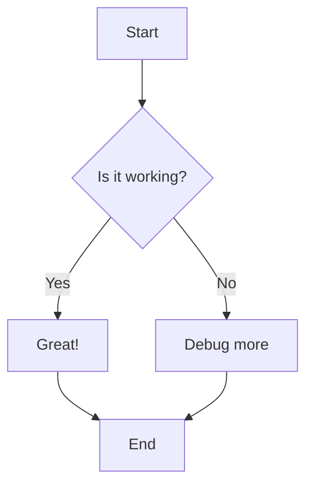
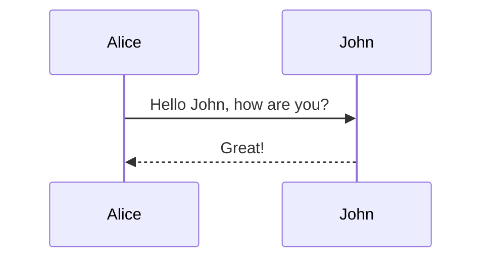

# Test Mermaid Diagram

This is a simple test to verify mermaid diagrams are rendering correctly.

## Simple Flow Chart



## Simple Sequence Diagram



## Regular Code Block (for comparison)

```javascript
function test() {
  console.log("This should have syntax highlighting");
}
```
